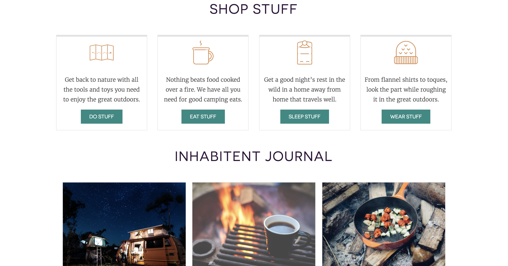
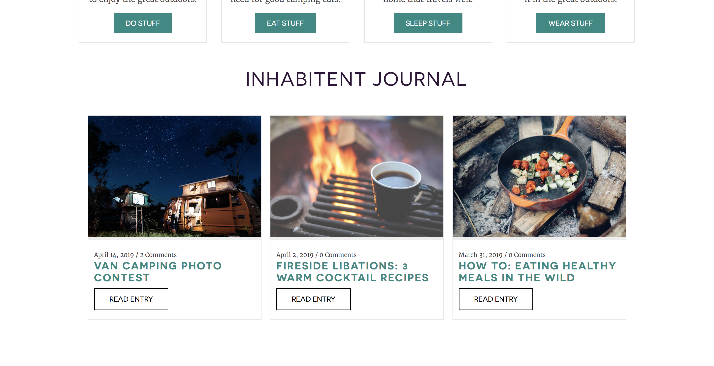
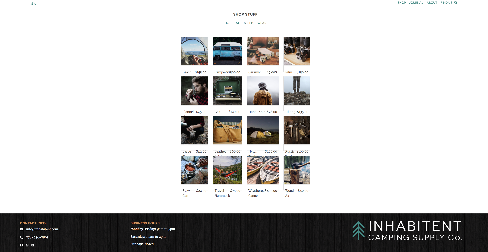
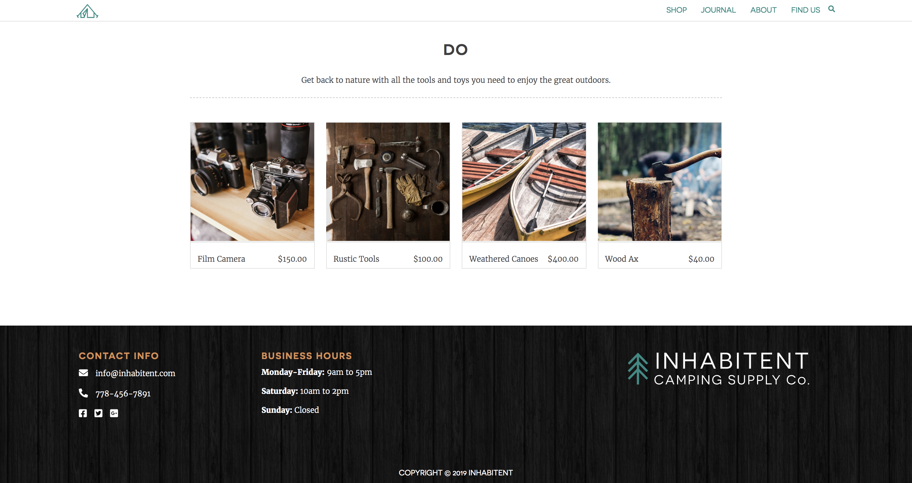
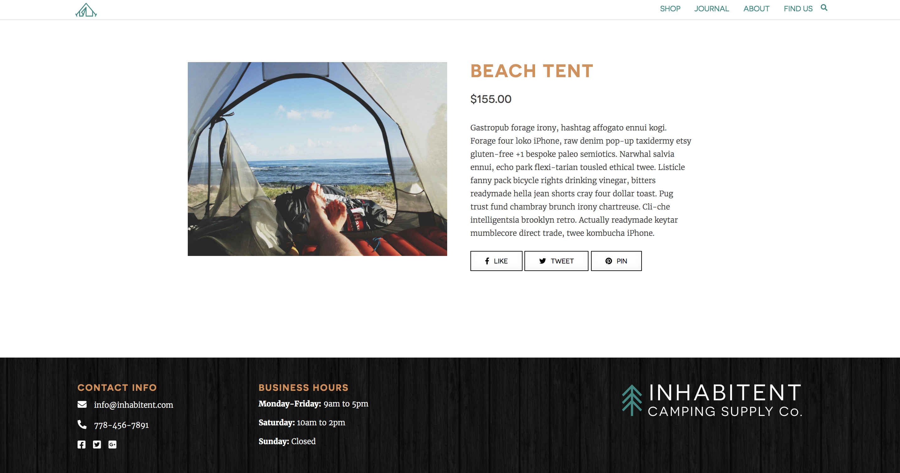
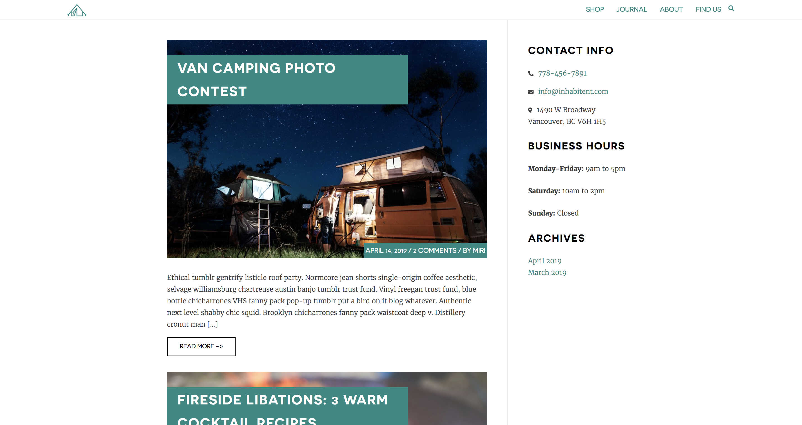
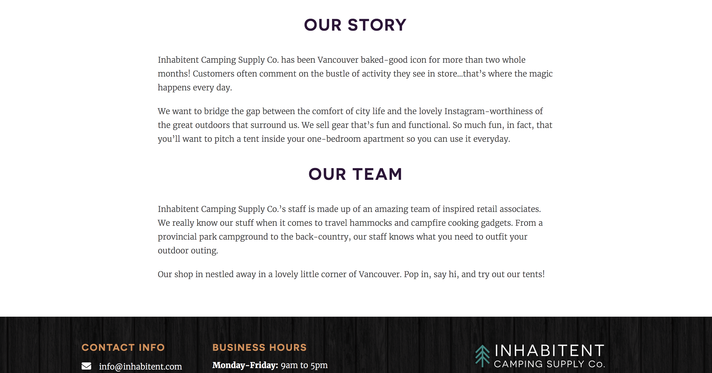
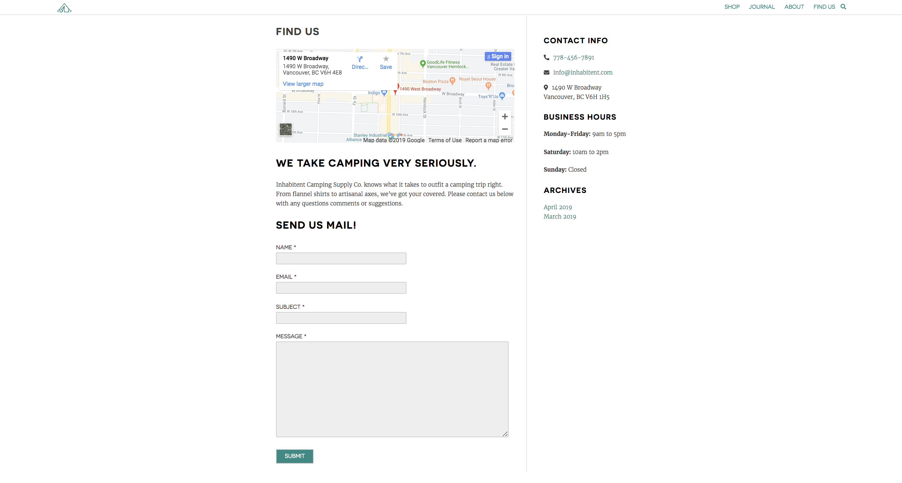

# Inhabitent Site

## Description
The Inhabitent site is a multi-page website with a blog for a camping supply company called Inhabitent Camping Supply Co. The site uses Wordpress and based on the underscores theme.

## Technologies Used 

* php
* Wordpress
* HTML5
* CSS3 and Sass 
* Jquery
* Gulp
* JavaScript
* Use of GIT and GitHub.

## Personal learnings
* Using WordPress as a content management system (CMS).
* Using custom post types and taxonomies for additional content types (using a functionality plugin).
* Using custom fields for additional metadata (using the Custom Field Suite plugin).
* Using php functions to request data from php pages.
 
## Installation

1. Download repository and then add it to your `wp-content` directory.

2. run `npm install`.

3. Update the proxy in `gulpfile.js`.